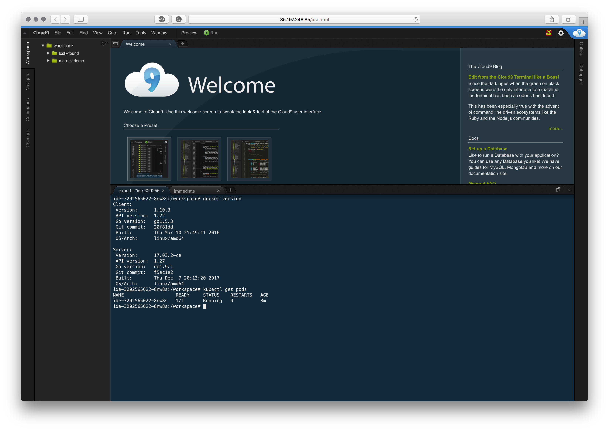

# `k9c` – Cloud9+kubectl container

This repository has build script and deployment manifest for a container that has Cloud9 IDE and `kubectl` installed
(along with other handy packages), it's intended to be used for training/workshops, as it can run as a pod in cluster
so all attendees need is a browser.


Deploy it to a GKE cluster (or other provider with functional storage and external load balancers):
```
kubectl create namespace ide 
kubectl create namespace ide-workspace
kubectl apply -f https://raw.github.com/errordeveloper/k9c/master/manifests/ide.yaml
kubectl apply -f https://raw.github.com/errordeveloper/k9c/master/manifests/traefik.yaml
```

Get exteral IP:
```
traefik_ip="$(kubectl get svc -n kube-system traefik -o jsonpath='{.status.loadBalancer.ingress[0].ip}{"\n"}')"
```

Next, open `http://${traefik_ip}/` in your browser and login with `username:password`.

Have a great Kubernetes experience with Cloud9 in your cluster!

> NOTE: it's mostly for training/workshops, at present it's not very secure – use it at your own risk.


